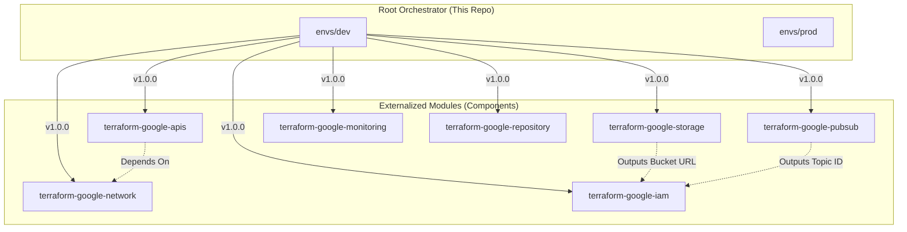

<div align="center">
  <h1>🏗️ Google Cloud Platform Infrastructure</h1>
  <p><strong>A modular, event-driven, secure, and highly scalable GCP infrastructure provisioned with Terraform.</strong></p>
</div>

---

## 📖 Overview

This repository acts as the **Root Orchestrator** (Config layer) for a complete Google Cloud Platform environment. It demonstrates advanced Infrastructure-as-Code (IaC) practices by composing completely decoupled, externalized Terraform modules to ensure immutability, separation of concerns, and least privilege IAM bindings.

### 🌟 Key Portfolio Highlights
- **Decoupled Architecture**: Uses the Blueprint/Component pattern where all modules live in independent repositories with semantic versioning.
- **Unified CI/CD**: Employs GitHub Actions reusable workflows for automated `terraform fmt`, `terraform validate`, static security scanning (`tfsec`/`checkov`), and controlled `plan`/`apply` deployments.
- **Environment Parity**: Separated environment states (e.g., `dev`, `prod`) using remote GCS backends and specific `tfvars`.
- **Security-First Network**: Custom VPC configuration with internal-only traffic and IAP SSH access securely provisioned.
- **Event-Driven Ready**: Infrastructure includes Pub/Sub messaging seamlessly integrated with Cloud Storage notifications and secure Service Accounts.

---

## 📦 Externalized Modules (Components)

This infrastructure relies on the following decoupled repositories (Terraform *mods*). Click on any of them to view their source code, variables, and documentation:

- [**terraform-google-apis**](https://github.com/AlvaroJ1212/terraform-google-apis) - Enables necessary GCP services and APIs.
- [**terraform-google-network**](https://github.com/AlvaroJ1212/terraform-google-network) - Custom VPC, subnets, and routing.
- [**terraform-google-storage**](https://github.com/AlvaroJ1212/terraform-google-storage) - Secure GCS buckets setup.
- [**terraform-google-pubsub**](https://github.com/AlvaroJ1212/terraform-google-pubsub) - Event-driven messaging topics.
- [**terraform-google-monitoring**](https://github.com/AlvaroJ1212/terraform-google-monitoring) - Dashboards and alerting configurations.
- [**terraform-google-iam**](https://github.com/AlvaroJ1212/terraform-google-iam) - Service accounts and IAM bindings.
- [**terraform-google-repository**](https://github.com/AlvaroJ1212/terraform-google-repository) - Artifact Registry setup.

---

## 📐 Architecture Diagram



---

## 🚀 CI/CD Pipeline

This project is governed by a strict CI/CD pipeline built on GitHub Actions:
1. **Pull Requests**: Automatically triggers `terraform plan` and static security scans (`tfsec`). The plan is posted as a comment on the PR.
2. **Merge to Main (Dev)**: Automatically triggers `terraform apply` for the `dev` environment.
3. **Production Deployment**: Requires manual trigger and explicit environment approval before executing `terraform apply` for `prod`.

---

## 🛠️ Usage

### Prerequisites
- [Terraform](https://developer.hashicorp.com/terraform/downloads) >= 1.5.0
- Google Cloud SDK (`gcloud`)

### Deploying Locally

1. Authenticate to Google Cloud:
   ```bash
   gcloud auth application-default login
   ```
2. Navigate to the desired environment (e.g., Development):
   ```bash
   cd envs/dev
   ```
3. Initialize Terraform (Downloads external modules and sets up GCS backend):
   ```bash
   terraform init
   ```
4. Plan and Apply:
   ```bash
   terraform plan
   terraform apply
   ```

---

*This project is part of my Cloud/DevOps engineering portfolio.*
